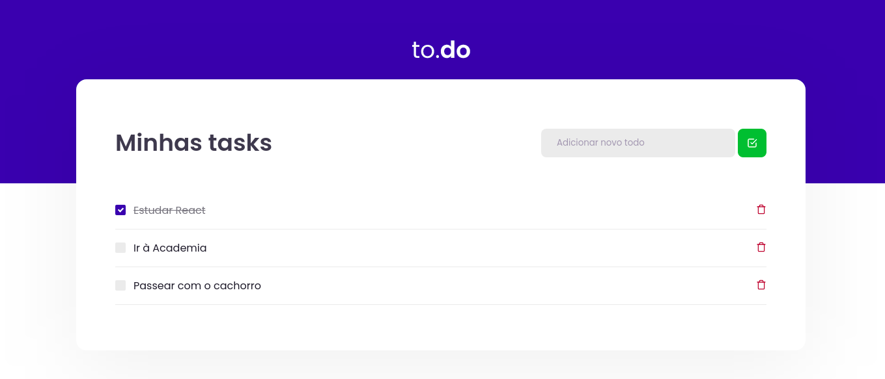

    

# Desafios 01 - Conceitos do React

Nesse desafio foi necessário adicionar três funcionalidades na aplicação a partir de um [template](https://github.com/rocketseat-education/ignite-template-reactjs-conceitos-do-react).

### Funcionalidades

* Adicionar um nova tarefa
* Remover uma tarefa
* Marcar e desmarcar uma tarefa como concluída